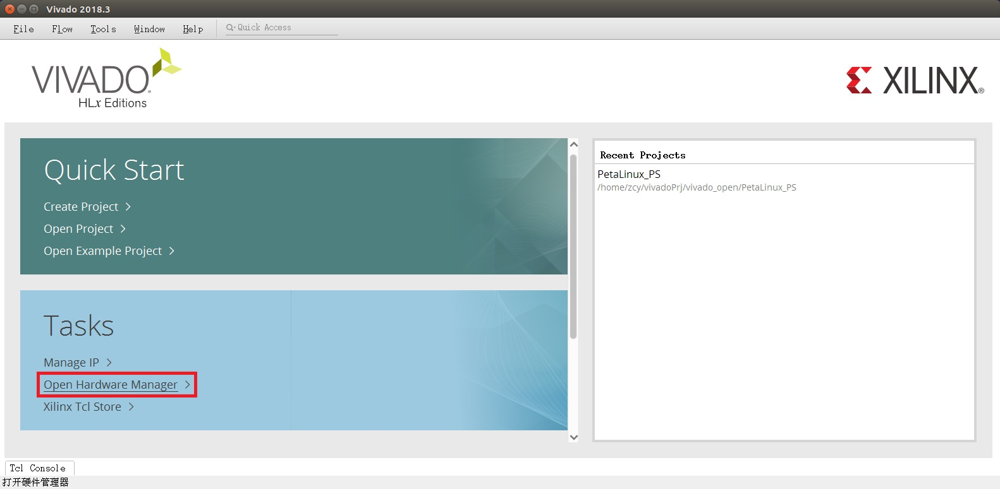

<big>
<big>

# 这是一个说明文档 #

## 介绍一下 ##

（8/31/2022 11:54:17 PM）

这是一个关于Xilinx-Zynq与Linux的一个简单说明，希望能帮助你更快地上手这个东西。所以文档主要是关于PS端的，PL端的东西基本不会出现，PS端和PL端的交互应该是通过DDR或者什么别的操作完成的，目前我不会...

首先希望你能有一点Linux/Ubuntu使用基础，比如Ubuntu命令行之类的，以及一点Vivado的使用基础。

By.南京理工大学电子工程与光电技术学院——阵列天线与阵列信号处理实验室，2021级硕士张纯杨。

&emsp;&emsp;

（OS.很离谱，md编辑器出Bug，图片渲染不正常，找原因找到了十二点半才发现是软件Bug）

## 简单概述 ##

 （9/1/2022 11:52:11 AM）

参考文档在docs文件夹里，注意ALINX给出的教程都是基于2017.4版本的，自己注意一下，有些东西参考一下就好，不过虚拟机中使用的Ubuntu系统版本是一样的。

### 硬件 ###

#### 芯片 ####

Zynq-7000系列，**XC7Z100FFG900-2, (在Vivado中建立工程时的选择)**

芯片的具体情况看看手册就好，比如PL端的查找表、触发器数量、PS端的核心情况之类。

#### 板子及外设 ####

ALINX的AX7450，如下图：

相对常用的外设包括：

- sd卡槽（赠送了32GB的sd卡和读卡器）
- 以太网
- 串口UART
- USB-OTG
- FMC
- PCIe

其他外设及具体外设配置情况请参考手册和原理图。

### 软件 ###

相关的软件包在pkg文件夹里，Vivado就不放了，自己下吧，pkg里提供一个license文件。

本人此时因为项目需求，软件版本全是2018.3相关的：

- Vivado 2018.3（包括SDK）
- PetaLinux 2018.3（如果你不知道这是啥，没关系，后面再说）
- VMware 16.0.0（这个虚拟机软件本身的版本无关紧要）
- Ubuntu 16.04.3（该Ubuntu系统版本是与PetaLinux 2018.3严格匹配的，当然你也可以多搞一个高版本的自己玩玩，比如22.04.1版本的GUI还挺好看，前提是硬盘够大，不过PetaLinux 2018.3必须要安装在Ubuntu 16.04.3中）
- MobaXterm Personal Edition v22.0（串口调试）

啰嗦地：大部分电脑都是Windows系统，比如我的Win 10（所以如果你的主机是Win 11或者以后更高版本可能有些东西也不适用了吧...），而上述的软件安装并不全是安装在Win主机上的。我们将虚拟机软件（VMware 16.0.0）和串口调试软件（MobaXterm Personal Edition v22.0）安装在Win主机上，再用VMware创建虚拟机，将Ubuntu 16.04.3系统挂给我们创建的虚拟机，再将Vivado 2018.3和PetaLinux 2018.3安装到虚拟机上。当然咱们大部分同志也都会在主机上安装Vivado，这无所谓，但是为了后续的一点方便，我选择虚拟机上也安装Vivado。

至于Ubuntu版本的选择，按照Xilinx官方文档UG1144 (PetaLinux Tools Documentation-Reference Guide)中关于PetaLinux 2018.3的安装要求：

所以除了VMware和串口调试软件的选择无关紧要以外，剩下这些的版本都要严格对应，至少Ubuntu的版本和PetaLinux版本有严格对应关系，不存在向下兼容之类的说法，切记！！！

## 软件安装 ##

（9/1/2022 12:43:44 PM） 

### VMware 16.0.0 ###

讲道理，这个没什么好说的，双击“VMware-workstation-full-16.0.0-16894299.exe”，选择安装路径，傻瓜式“下一步”就好了。密钥在key.txt文件里，随便选一个应该就可以了，要是都不行的话，找找Bing、Baidu、CSDN啥的，应该有共享出来的。

### 虚拟机 & Ubuntu 16.04.3  ###

这里我没有放任何截图 ，这块随便点点，自己摸索一下，基本没啥坑，很简单的。

打开VMware，在界面中很容易找到“新建虚拟机”，点一下，然后如下操作：

- “典型” -> 下一步
- “安装程序光盘映像文件” -> 浏览 -> 选择./pkg/VMware./ubuntu-16.04.3-desktop-amd64.iso -> 下一步
- “全名”、“用户名”、“密码”和“确认”：全名和用户名可以相同，用户名和密码都建议短一点，尤其密码，最好是很容易输入，比如098098，因为后面会在终端里高强度输入密码，密码复杂的话很不方便 -> 下一步
- “虚拟机名称”：无所谓，有就行；“位置”：这个要改，放到硬盘空间足够大的地方，单独创建文件夹，便于管理 -> 下一步
- “最大磁盘大小”：建议大一点，之前提到过的PetaLinux 2018.3安装要求里有100GB要求，但Vivado也占用很大一块空间，我的选择是200GB（此处选择的大小并不是直接在你的硬盘里真的占用这么大，我觉得可以理解为VMware指示Ubuntu系统：计算机有XXXGB空间，但实际在Ubuntu需要空间时，VMware现给Ubuntu从主机拿空间）；“将虚拟磁盘存储为单个文件/拆分成多个文件”：我个人认为无所谓 -> 下一步
- “自定义硬件”：根据之前提到过的PetaLinux 2018.3安装要求，此处需要把内存改大，默认内存4GB，软件安装要求最小要8GB，我的选择是16GB，不要小于8GB，也不要超过你自己电脑的实际内存就好 -> 完成
- 然后点击“开启此虚拟机”或者界面中的绿色三角，开始等待，等待时间不长不短，可以趁现在喝点茶

现在我们就在VMware中得到了一个安装有Ubuntu 16.04.3系统但什么都没配置的虚拟机。接下来简单配置一下系统。

#### 进入系统 ####

输入密码后按回车（注意此时小键盘NumLock可能未开启，按着按着可能就跑到访客用户登录了，如果后边有某个奇怪问题，考虑是不是不小心进到访客模式下了），目前系统语言是英语的，后面可以安装中文，最开始进入系统可能会出现升级相关的提示，选择不升级，保持系统版本。

#### 更改Ubuntu的源 ####

Ubuntu默认从美国的源来下载包，速度奇慢无比甚至会无法连接。打开设置（界面左侧齿轮扳手图标：System Settings），选择Software & Updates -> Download from: -> Other，在里面找到China，理论上随便选一个就行，但我建议可以选择mirrors.aliyun.com或者ubuntu.cn99.com，或者直接点击Select Best Server稍等片刻自动选择最好的（我这里的最佳源匹配到了：ubuntu.cn99.com），点击Choose Serveer，输入密码 -> 回车 -> Close -> Reload, 再次稍等片刻。

#### 设置中文 ####

在设置中选择Language Support -> Remind Me Later（可能不会弹出对话框，可跳过） ->Install/Remove Languages...，在里面找到Chinese (simplified)，勾选后点击Apply，输入密码 -> 回车，进入安装中文的等待。下载安装结束后，将Language for menus and windows:滚动到最下边，把“汉语（中国）”拖动到最上（要是没反应，多拖动几次），再将Keyboard input method system:改为fcitx，点击Apply System-Wide -> 输入密码 -> 回车，再选择窗口上方Regional Formats选项卡，把English (United States)改为“汉语（中国）”，点击Apply System-Wide -> 输入密码 -> 回车 -> close，关闭设置窗口。

#### 关闭访客模式 ####

点击屏幕右上角的齿轮状关机按钮，可能会发现有一个Guest Session，这是系统本身开启了访客模式，可能会影响到登录用户，我们把他关掉。在桌面单击鼠标右键 -> Open Terminal，输入命令：

<pre>sudo gedit /usr/share/lightdm/lightdm.conf.d/50-guest-wrapper.conf</pre>
	
Terminal界面弹出：

<pre>[sudo] password for XXX:</pre>

此时键盘输入密码不会在Terminal界面显示，这是正常，输入完成后按下回车即可，在弹出的文本编辑器的末尾中添加一行：

<pre>allow-guest=false</pre>

点击右上角Save，关掉对话框。

#### 设置bash ####

在Terminal中输入命令：

<pre>sudo dpkg-reconfigure dash</pre>

用左右箭头控制选择No，然后回车。

#### 重启 ####

在Terminal中输入命令：
<pre>reboot</pre>

等待重启，再输入密码进入系统，会弹出对话框询问你是否更新语言，我的建议是保留旧名称，可以直接使用系统生成的这些文件夹，同时直接避免路径不能带中文字符的问题，当然改掉也好，后面有需要自己建新文件夹也不错。

记得在设置 -> 亮度和锁屏中把关闭屏幕改为从不，把锁定关掉，这样可以避免很多麻烦。

### 软件包的安装 ###

安装顺序（虽然好像也没什么严格的顺序...）：

1. Vivado 2018.3（官网自己下载吧）
2. PetaLinux 2018.3（有包）
3. NFS（apt-get方法）

#### Vivado 2018.3 ####

可以在Xilinx官网中找到Vivado 2018.3进行下载：

> [Vivado官网下载](https://www.xilinx.com/support/download/index.html/content/xilinx/en/downloadNav/vivado-design-tools/archive.html)

或者找师哥师姐搞一份。

可以直接在虚拟机中下载，或者在主机下载好直接拖拽到虚拟机中你想保存的位置，或者也可以用师哥师姐的U盘，插到主机USB接口，VMware会询问你将U盘连接到何处：

选择连接到虚拟机，再点选你的虚拟机名称后确定即可。

或者这样：

**Ps.如果U盘插入后连接了虚拟机也没反应，这样试试：**

选择你的U盘的接口形式，无非就是2/3，都试试应该没问题。改过接口形式后，需要再执行一次刚才的操作：虚拟机 -> 可移动设备...

理论上Ubuntu中应该出现U盘相关的东西了：

现在可以进行安装了，将文件进行解压，鼠标右键单击文件 -> 提取到此处，再进入解压出来的文件夹，在文件夹内打开终端。

首先更改安装文件的权限，输入命令：

<pre>sudo chmod +x xsetup</pre>

再输入命令：

<pre>sudo ./xsetup</pre>

这时可能会提示有一长串东西（假设是/xxx/yyy/zzz/aaa/bbb/ccc）权限不够，用命令修改一下就好：

<pre>sudo chmod +x /xxx/yyy/zzz/aaa/bbb/ccc</pre>

我在第一次安装的时候在这里出现了缺少依赖项的问题，如果你也出现了类似问题，可以先进行下一节PetaL iux 2018.3安装中第一步：获取依赖项（只获取依赖项就好了，后面的操作先停停），然后再回过头来继续安装Vivado。

再执行一次：

<pre>sudo ./xsetup</pre>

开始安装：

点击Continue，不安装新版本，然后一路Next和I agree，版本选择选第二个Vivado HL Design Edition：

选择安装什么东西：

上边红框的SDK一定要有！！！DocNav其实算是可有可无吧，我也没用过。插一句，关于IP核的手册可以直接参考官网，用哪个就搜哪个看哪个呗：

> [IP 核](https://china.xilinx.com/products/intellectual-property.html)

下边红框周围的Devices的选择，可以根据自己的设备型号来选，AX7450的芯片是Zynq-7000系列的，多选几个也无所谓，看看后期能不能用上，一步到位也可以，虽然存储空间也是个问题...

Next之后，选择安装位置，我看很多教程都是安装在/opt目录下的，不知道为啥，照着做吧，其实放在哪都无所谓，主要是有些命令可以直接复制不用手动改了（图片里红字是因为那个路径下我已经装过了）：

Next，开始等待，安装结束后会自动打开Vivado License Manager，Load License -> Copy License...选择即可：

**此次加载license可能不成功，但不会提示，这回导致后期在某次Synthesis时可能会因此报错，到时候在Vivado界面中的Help -> Manage License...再添加一次就好了**

接下来添加Vivado相关的权限，在终端输入：

<pre>sudo chmod 777 -R /opt/Xilinx/

sudo chmod 777 -R ~/.Xilinx/</pre>

然后安装下载器驱动，终端输入：

<pre>cd /opt/Xilinx/Vivado/2018.3/data/xicom/cable_drivers/lin64/install_script/install_drivers/

sudo ./install_drivers</pre>

接下来配置Vivado的环境变量，很多教程采用直接的source命令配置环境变量，但是这样在每次启动Vivado的时候都要重新输入一次，太麻烦了，我选择直接修改bashrc文件，新建终端，输入命令：

<pre>sudo gedit ~/.bashrc</pre>

在文档最后添加两行：

<pre>source /opt/Xilinx/Vivado/2018.3/settings64.sh

source /opt/Xilinx/SDK/2018.3/settings64.sh</pre>

保存，关闭。

将板子与下载器、电脑连接好，上电，并将下载器与虚拟机进行连接（默认连接到主机上，而且不会像刚才插入U盘那样提示）：

然后再重新打开一个终端，输入

<pre>vivado</pre>

即可打开Vivado 2018.3。

可以先不新建工程，直接点击初始界面的Open Hardware Manager：

点击Open target -> Auto Connect

应该会在Hardware处出现板子相关的东西：

至此，Vivado 2018.3安装结束。

#### PetaLinux 2018.3 ####

</big>
</big>